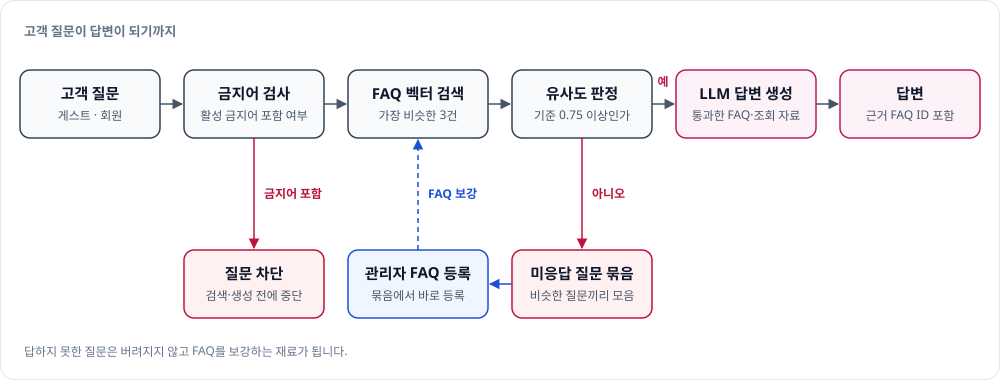

# UBot-BE

**UBot**은 통신사 고객이 요금제, 가입, 로밍, 매장 같은 궁금증을 대화하듯 물어보면, 등록된 FAQ를 근거로 답해 주는 상담 챗봇입니다. 이 저장소는 그 백엔드 서버입니다.

- 프론트엔드: [UBot-FE](https://github.com/ureca-UBot/UBot-FE)
- 대상 독자: 이 저장소를 개발하는 팀원

## UBot이 답하는 방식



- **FAQ와 맞는 질문에만 답합니다.** 질문과 가장 비슷한 FAQ 3건을 찾고, 유사도가 기준(0.75) 이상인 것만 씁니다. 기준을 넘는 FAQ가 없으면 LLM을 부르지 않고 "정확한 답변을 찾지 못했습니다"라고 답합니다.
- **FAQ의 종류에 맞는 자료로 답합니다.** FAQ에는 처리 의도(intent)가 붙어 있습니다. 일반 FAQ는 원문을 근거로 넘기고, 매장 FAQ가 걸리면 근처 매장을 조회해 답하며, 사용자 정보 FAQ가 걸리면 로그인한 사용자의 정보를 참고 자료로 넘깁니다.
- **근거를 밝힙니다.** 답변에는 어떤 FAQ를 썼는지(`evidence_ids`)와 답변 상태가 함께 들어 있습니다. 자료에 값이 없으면 답을 보류하고, 질문이 모호하면 되묻습니다.
- **못 답한 질문이 FAQ를 키웁니다.** 답하지 못한 질문은 비슷한 것끼리 묶여 관리자에게 보이고, 관리자는 묶음에서 바로 FAQ를 등록할 수 있습니다.

타임아웃과 재시도까지 포함한 상세 흐름은 [architecture.md](docs/architecture.md#챗봇-질문-처리-흐름)에 있습니다.

## 주요 기능

### 고객용

| 기능 | 설명 |
|---|---|
| **AI 상담 챗봇** | FAQ를 근거로 답변을 생성합니다. 생성에 실패하면 같은 질문을 다시 시도할 수 있고(처음 시도를 포함해 최대 3회), 응답이 180초를 넘으면 작업을 취소합니다. |
| **채팅 속 매장 안내** | 매장을 묻는 질문에는 근처 매장(기본 반경 3km, 최대 5곳)을 조회해 답변과 지도용 매장 목록을 함께 내려줍니다. 질문에 나온 장소를 기준으로 찾고, 장소가 없으면 위치가 필요하다고 알린 뒤 화면이 현재 위치와 함께 다시 요청하면 그 위치를 기준으로 찾습니다. |
| **내 정보 기반 답변** | 내 정보를 묻는 질문에는 로그인한 사용자의 이름·거주 지역·가입일을 참고해 답합니다. 요금·데이터 사용량·미납 정보는 제공하지 않습니다. |
| **실시간 인기·급상승 FAQ** | 최근 60분 동안 회원 질문의 답변에 쓰인 FAQ를 집계해 인기, 급상승, 지역별 급상승 순위를 5위까지 보여 줍니다. 기본 설정에서는 60분 안에 20회 이상 쓰인 FAQ만 순위에 오릅니다. 5분마다 갱신하고, 지역은 접속 IP로 판별합니다. 로그인이 필요합니다. |
| **비회원(게스트) 상담** | 로그인하지 않아도 질문할 수 있습니다. 세션(30분)으로 식별하고, 질문 횟수는 관리자 설정값(기본 5회)까지입니다. 답변 생성 오류나 시간 초과로 실패한 질문은 횟수에 넣지 않습니다. 로그인하면 게스트 때의 대화 기록이 회원 계정으로 이어집니다. |
| **회원 기능** | 회원가입, 로그인, 로그아웃, 토큰 재발급, 내 정보 조회·수정을 제공합니다. |
| **매장 찾기** | 지역·지도 범위·현재 위치로 매장을 찾고, 지도 확대 수준에 맞춰 매장을 묶어 보여 줍니다. 서비스 유형으로 걸러 볼 수 있고, 주소나 장소 이름으로 기준 위치를 검색할 수 있습니다. |
| **길찾기** | 현재 위치에서 매장까지 도보·자동차·대중교통 경로를 안내합니다. 대중교통은 후보 경로를 소요 시간이 짧은 순으로 보여 주고, 고른 경로에는 정류장까지의 도보 구간을 채워 줍니다. |

### 관리자용

| 기능 | 설명 |
|---|---|
| **FAQ 관리** | FAQ를 등록·수정·삭제·복구하고, 카테고리를 등록·수정·삭제합니다. FAQ마다 처리 의도(intent)를 지정합니다. 수정할 때마다 이전 버전을 보관하고, 어떤 답변에 어떤 FAQ가 몇 번째 근거로 쓰였는지 볼 수 있습니다. |
| **미응답 질문 관리** | 답하지 못한 질문 묶음을 최근순·건수순으로 보고, 승인·보류·반려하거나 FAQ로 등록합니다. |
| **금지어 관리** | 금지어를 등록·수정하고 켜거나 끕니다. 금지어가 들어간 질문은 검색과 답변 생성 전에 차단하며, 변경은 바로 반영됩니다. |
| **게스트 설정** | 비회원이 질문할 수 있는 최대 횟수를 조회·변경합니다. |
| **매장 관리** | 매장을 등록·수정·삭제·복구하고, 이름·전화번호·지역·서비스 유형으로 찾습니다. |

API 경로와 인증 방식은 [architecture.md](docs/architecture.md)에, 오류 코드는 [error-codes.md](docs/reference/error-codes.md)에 있습니다. 서버를 띄우면 Swagger UI에서 전체 API를 볼 수 있습니다.

## 기술 구성

| 영역 | 사용 기술 |
|---|---|
| 서버 | Java 21, Spring Boot 4.1.1, Spring Security + JWT |
| 데이터 | PostgreSQL 18 — pgvector(FAQ 벡터 검색, 미응답 질문 묶기), PostGIS(매장 위치 검색), Flyway |
| 캐시·스케줄 | Redis 8 — FAQ 순위 스냅샷 저장, 스케줄러 중복 실행 방지(ShedLock) |
| AI | `AI_MODE`로 Ollama와 vLLM 중 하나를 고릅니다(기본 Ollama). Ollama는 임베딩 `bge-m3:567m`(REST 직접 호출)과 환경변수로 지정한 채팅 모델(Spring AI 2.0.1로 호출)을 쓰고, vLLM은 OpenAI 호환 API로 답변 생성과 임베딩을 호출합니다. 매장 조회는 tool calling을 씁니다. 벡터는 임베딩 서버별(Embedding Profile)로 따로 저장해서 한 DB에서 두 서버를 오갈 수 있습니다. |
| 외부 API | 카카오 로컬(주소·장소 검색), 카카오맵 길찾기(도보·대중교통), 카카오모빌리티 길찾기(자동차) |
| 지역 판별 | MaxMind GeoLite2 — 접속 IP로 시도 판별 |
| 모니터링 | Micrometer, Prometheus (`/actuator/prometheus`). 로컬 Compose에 Prometheus가 들어 있고, Nginx는 이 경로를 외부에 열지 않습니다. |
| 배포 | Docker Compose, Nginx(`/api` 접두사 처리, 게스트 채팅 속도 제한), GitHub Actions(CI, 수동 CD) |
| 테스트 인프라 | Terraform(AWS 네트워크, GPU 테스트 서버), vLLM·SGLang LLM 서빙 런타임, vLLM 임베딩 서버 |

환경변수 전체 목록은 [.env.example](.env.example)에, 주요 설정의 설명은 [configuration.md](docs/reference/configuration.md)에 있습니다.

## 바로 실행해 보기

JDK 17 이상, 실행 중인 Docker Desktop, Git이 필요합니다.

```powershell
Copy-Item .env.example .env     # POSTGRES_PASSWORD와 JWT_SECRET을 반드시 수정
.\tools\ubot.ps1 up
.\gradlew.bat bootRun
```

`http://localhost:8080/actuator/health`가 `"status":"UP"`이면 실행된 것입니다. API는 Swagger UI(`http://localhost:8080/swagger-ui.html`)에서 볼 수 있습니다.

- `.\tools\ubot.ps1 up`은 `.env`의 `AI_MODE`를 읽어 필요한 컨테이너를 띄웁니다. 기본값 `ollama`면 PostgreSQL(15432), Ollama(11435), Redis(16379), Prometheus(19090)를 띄우고 임베딩 모델을 내려받습니다. `OLLAMA_CHAT_MODEL`에 값이 있으면 채팅 모델도 함께 받습니다. 괄호 안은 `.env.example` 기준 호스트 포트입니다.
- GPU가 있는 PC에서는 `AI_MODE=vllm`으로 바꾸고 같은 명령을 실행하면 Ollama 대신 vLLM 서버 두 개가 뜹니다([quickstart](docs/quickstart.md#vllm으로-바꿔-실행하기)).
- `JWT_SECRET`을 바꾸지 않으면 기동되지 않습니다([quickstart](docs/quickstart.md#2-env-만들기)).
- 챗봇 답변까지 보려면 채팅 모델과 FAQ 데이터가 필요합니다([local-data.md](docs/how-to/local-data.md)).
- 길찾기와 위치 검색, 채팅에서 장소 이름으로 매장을 찾는 기능은 `KAKAO_REST_API_KEY`가 있어야 동작합니다.
- 프론트와 백엔드를 같은 Nginx로 보려면 프론트를 빌드한 뒤 `docker compose -f docker-compose.yml -f docker-compose.web.yml up -d web`을 실행하고 `http://localhost:8088`을 엽니다.

테스트는 Docker만 실행 중이면 됩니다.

```powershell
.\gradlew.bat test
```

## 더 알아보기

| 궁금한 것 | 문서 |
|---|---|
| 처음부터 단계별로 실행하기 | [quickstart.md](docs/quickstart.md) |
| 코드 구조, API, 요청 흐름 | [architecture.md](docs/architecture.md) |
| 환경변수와 설정값 | [configuration.md](docs/reference/configuration.md) |
| 오류 코드 | [error-codes.md](docs/reference/error-codes.md) |
| 실행이 안 될 때 | [troubleshooting.md](docs/troubleshooting.md) |
| DB 조회, ERD, 관리자 계정 만들기 | [db-access.md](docs/how-to/db-access.md) |
| 로컬 FAQ 데이터와 채팅 모델 준비 | [local-data.md](docs/how-to/local-data.md) |
| 로컬 DB 초기화, 기본 FAQ·계정 넣기 | [reset-local-db.md](docs/how-to/reset-local-db.md) |
| 프론트엔드 연동 | [frontend-integration.md](docs/how-to/frontend-integration.md) |
| LLM 호출과 프롬프트 | [llm-module.md](docs/how-to/llm-module.md) |
| 프롬프트 파일 고치기 | [prompts/README.md](src/main/resources/prompts/README.md) |
| 예외와 오류 코드 작성 규칙 | [exception.md](src/main/java/com/ubot/common/manual/exception.md) |
| 배포 | [deploy.md](docs/deploy.md) |
| LLM 서빙 런타임(vLLM·SGLang) | [infra/llm/README.md](infra/llm/README.md) |
| AWS 테스트 인프라(Terraform) | [infra/terraform/README.md](infra/terraform/README.md) |
| 브랜치·PR·커밋 규칙 | [CONTRIBUTING.md](CONTRIBUTING.md) |
| 유사도 기준 실험 결과 (보고서는 0.73을 1차 채택, 코드 기본값은 0.75) | [FAQ_Threshold_테스트_보고서.md](docs/FAQ_Threshold_테스트_보고서.md) |
