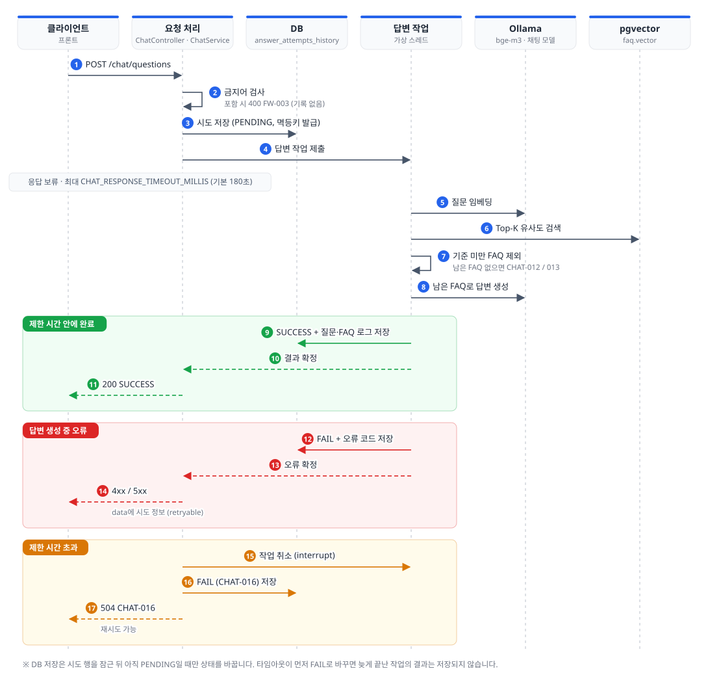
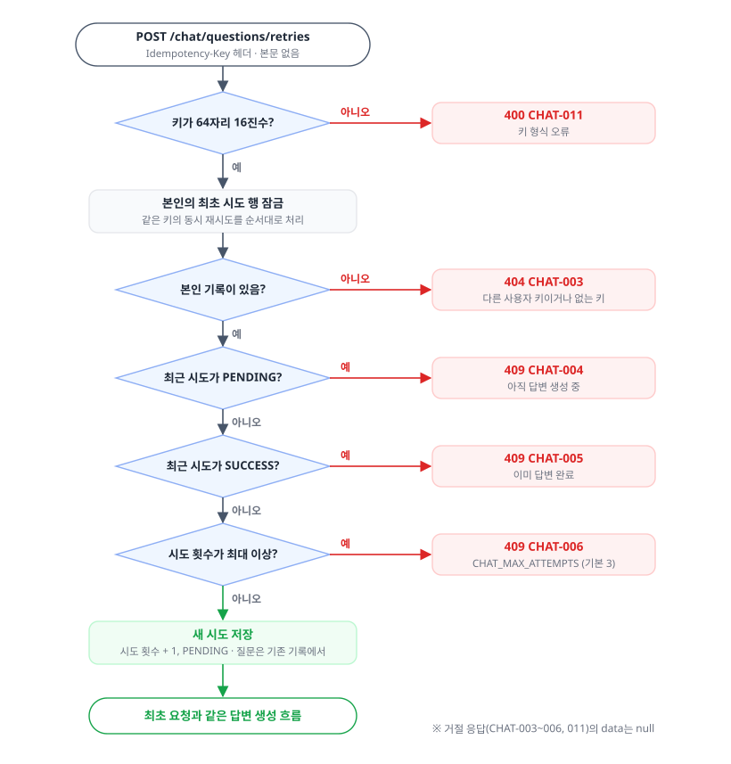

# 코드 구조와 요청 흐름

> 문서 기준: UBot-BE `develop` [`2fdb6ec`](https://github.com/ureca-UBot/UBot-BE/commit/2fdb6ec145d6092696651d83e4b6ff01ffb821c0) (2026-09-29 19:55 KST 커밋, #105 병합 시점) · 작성일 2026-09-30
>
> GitHub PR·이슈 상태: 2026-09-30 09:23 KST 조회 기준

## 패키지 구조

```text
com.ubot
├── auth           인증 (JWT 발급·검증, refresh token, Security 설정)
├── user           사용자 엔티티·저장소·서비스, 내 정보 조회·수정 (/auth/me)
├── chat           질문 처리 진입점 (컨트롤러 → ChatService), 답변 시도 기록·재시도
├── ai             FAQ 프롬프트 구성과 LLM 호출 연결 (AiService)
├── prompt         질문·FAQ를 프롬프트 템플릿에 반영 (PromptService)
├── llm            LLM 요청 검증·Ollama 호출·오류 변환
├── embedding      Ollama /api/embed 직접 호출 (EmbeddingService)
├── faq            FAQ·카테고리 CRUD, 수정 이력(old_faq)·참고 로그(faq_log), FAQ 벡터 검색
├── forbiddenword  금지어 관리 API, 채팅 입력 금지어 필터 (메모리 캐시)
├── unanswered     답을 찾지 못한 질문 저장과 유사 질문 묶기
├── location       카카오 로컬 API 연동 (주소·좌표 검색)
├── store          매장 조회 (목록·상세·근처·지도·클러스터, PostGIS), 관리자 매장 관리
├── direction      매장 길찾기 (카카오 도보·대중교통, 카카오모빌리티 자동차)
├── global         공통 설정 (채팅 답변 생성용 가상 스레드 Executor)
└── common         공통 응답·에러코드·전역 예외 처리, OpenAPI 설정
```

| 종류 | 위치 |
|---|---|
| DB 마이그레이션 | `src/main/resources/db/migration/V1`~`V15` |
| 매장 조회 SQL | `src/main/resources/sql/store/*.sql` |
| FAQ 프롬프트 | `src/main/resources/prompts/faq-system.txt`, `faq-user.txt` |
| DB 이미지 | `infra/postgres/Dockerfile` |
| 개발용 컨테이너 | `docker-compose.yml` |
| 배포용 | `Dockerfile`, `docker-compose.deploy.yml`, `infra/nginx/nginx.conf` ([deploy.md](deploy.md)) |
| GitHub Actions | `.github/workflows/ci.yml`, `commit-message.yml`, `cd-manual.yml` |
| 응답·예외 작성 규칙 | `src/main/java/com/ubot/common/manual/*.md` |

## API 개요

모든 응답은 `ApiResponse<T>`(`success`, `code`, `message`, `data`) 형식입니다. 요청·응답 필드는 애플리케이션 실행 후 Swagger UI(`/swagger-ui.html`)에서 확인하세요.

| 영역 | 경로 | 인증 |
|---|---|---|
| 인증 | `POST /auth/signup`, `/auth/login`, `/auth/refresh` | 불필요 |
| 인증 | `POST /auth/logout` | JWT |
| 내 정보 | `GET`, `PATCH /auth/me` | JWT |
| 챗봇 | `POST /chat/questions`, `POST /chat/questions/retries` (`Idempotency-Key` 헤더) | JWT |
| 매장 | `GET /stores`, `/stores/{storeId}`, `/stores/nearby`, `/stores/map`, `/stores/map/clusters`, `/stores/regions/sidos`, `/stores/regions/sigungus` | 불필요 |
| 길찾기 | `GET /stores/{storeId}/directions?mode=WALK\|CAR\|TRANSIT`, `POST /stores/{storeId}/directions/transit-detail` | 불필요 |
| 위치 | `GET /locations/search?query=` | 불필요 |
| 관리자 FAQ | `/admin/faqs`, `/admin/deleted-faqs`, `/admin/faqs/restore`, `/admin/faq-categories/**`, `/admin/faq-logs/**`, `/admin/old-faqs/faq` | JWT + `ADMIN` |
| 관리자 금지어 | `/admin/forbidden-words/**` | JWT + `ADMIN` |
| 관리자 매장 | `/admin/stores/**` (등록·수정·삭제·활성화·목록·삭제 목록) | JWT + `ADMIN` |
| 상태 확인 | `GET /actuator/health` | 불필요 |

## 인증

- 세션을 쓰지 않는 stateless 구조입니다(`SecurityConfig`).
- 인증 없이 호출할 수 있는 경로는 `/auth/login`, `/auth/signup`, `/auth/refresh`, `/stores/**`, `/locations/**`, `/actuator/health`, Swagger(`/v3/api-docs/**`, `/swagger-ui/**`, `/swagger-ui.html`)입니다. `/admin/**`은 `ADMIN` 역할이 필요하고, 나머지는 모두 JWT가 필요합니다.
- `JwtAuthenticationFilter`가 `Authorization: Bearer <token>`을 검증한 뒤, 토큰의 사용자 ID로 **매 요청마다 DB에서 탈퇴하지 않은 사용자를 조회**합니다. 권한은 토큰의 `role` claim이 아니라 DB의 `users.role`에서 가져옵니다.
- 인증이 필요 없는 경로라도 잘못되거나 만료된 Bearer 토큰을 보내면 필터에서 오류 응답이 나갑니다.
- 채팅 응답은 비동기(`DeferredResult`)로 완료되므로, `/chat/` 경로의 내부 `ASYNC` 재디스패치는 인증 검사 없이 허용합니다. 최초 요청은 JWT 인증을 거칩니다.
- Access token 서명 키는 `JWT_SECRET`(Base64, 32바이트 이상)이며 기동 시점에 디코딩합니다. 값이 올바르지 않으면 애플리케이션이 뜨지 않습니다.
- Refresh token은 사용자당 1개(`refresh_tokens.user_id` UNIQUE)입니다. 로그인과 재발급 때마다 새 값으로 교체하므로, 다른 기기에서 로그인하면 이전 refresh token은 쓸 수 없습니다. 로그아웃은 refresh token을 삭제합니다.
- 회원가입은 항상 `USER` 역할로 생성합니다. `ADMIN` 계정을 만드는 API는 없습니다([db-access.md](how-to/db-access.md#로컬에서-관리자-계정-만들기)).
- 비밀번호는 BCrypt로 저장합니다.

## 챗봇 질문 처리 흐름

```text
POST /chat/questions  { "question": "..." }   (JWT 필수, 1~4000자)
  → ChatService.createChat
      → ForbiddenWordFilterService : 활성 금지어 포함 시 FW-003 (시도 기록을 남기지 않음)
      → ChatAttemptsService        : answer_attempts_history에 PENDING 행 저장, 멱등키 발급
      → chatExecutor(가상 스레드)에 답변 생성 작업 제출 후 DeferredResult 반환
          → FaqVectorService.getSimilarList(question, CHAT_TOP_K)
              → EmbeddingService    : Ollama /api/embed로 1024차원 벡터 생성
              → FaqVectorRepository : 삭제되지 않은 FAQ 대상 pgvector 코사인 유사도 검색
          → 결과 없음 → 미응답 질문 저장 → CHAT-012 (NO_FAQ)
          → 각 결과를 CHAT_CONFIDENCE_THRESHOLD와 비교해 미만은 제외
             → 남은 결과 없음 → 미응답 질문 저장 → CHAT-013 (INSUFFICIENT_FAQ), LLM 호출 안 함
          → AiService → PromptService → LlmService → OllamaClient (남은 FAQ만 전달)
          → 성공: question_log, faq_log(순위·유사도), 시도 SUCCESS를 한 트랜잭션으로 저장
          → 실패: 시도 FAIL과 오류 코드 저장, 재시도 가능 여부와 함께 오류 응답
  → CHAT_RESPONSE_TIMEOUT_MILLIS 초과 시 시도를 FAIL(CHAT-016)로 저장하고 작업을 취소
```

같은 흐름을 답변 확정과 타임아웃이 경쟁하는 부분까지 포함해 그리면 아래와 같습니다.



성공 응답의 `data`는 `ChatResponseDto`입니다.

| 필드 | 의미 |
|---|---|
| `answer` | 성공 시 모델이 생성한 문자열, 실패 시 안내 문구 |
| `status` | `SUCCESS` 또는 `FAIL` |
| `idempotencyKey` | 같은 질문의 재시도에 쓰는 64자리 16진수 키 |
| `attemptCount` | 최초 요청을 포함한 몇 번째 시도인지 |
| `retryable` | 지금 재시도할 수 있는지. 프론트가 재시도 버튼 활성화 여부를 판단하는 안내값이며, 실제 재시도 요청은 서버가 다시 검증합니다(#82) |

회의 결정에 따라 SSE 스트리밍 없이 완성된 답변을 JSON 응답 하나로 반환합니다(#82 리뷰). 답변 생성 중 실패하면 HTTP 상태와 `code`는 오류별로 다르지만 `data`에는 같은 형식의 `ChatResponseDto`가 들어 있습니다. 코드별 의미는 [오류 코드 Reference](reference/error-codes.md#채팅), 프론트 연동 방법은 [프론트엔드 연동 가이드](how-to/frontend-integration.md#채팅)를 참고하세요.

### 재시도

- `POST /chat/questions/retries`에 `Idempotency-Key` 헤더로 앞에서 받은 키를 보냅니다. 본문은 없습니다.
- 본인의 가장 최근 시도가 `FAIL`이고 시도 횟수가 `CHAT_MAX_ATTEMPTS`(기본 3) 미만일 때만 새 시도를 만듭니다. 질문은 기존 기록에서 가져옵니다.
- 같은 키로 동시에 재시도하면 최초 시도 행을 잠가 순서대로 처리합니다. `PENDING`이면 `CHAT-004`, 이미 성공했으면 `CHAT-005`, 횟수를 다 썼으면 `CHAT-006`이며, 이때 `data`는 `null`입니다.



### 미응답 질문 저장 (#105)

`CHAT-012`(검색 결과 없음)나 `CHAT-013`(기준 미달)로 끝나는 질문은 실패 기록을 남기기 전에 `unanswered_questions`에 저장하고, 비슷한 질문끼리 `unanswered_question_groups`로 묶습니다(`UnansweredQuestionService`).

1. 같은 답변 시도(`attempt_id`)가 이미 저장돼 있으면 건너뜁니다.
2. 질문을 다시 임베딩합니다. FAQ 검색 때와 별도로 Ollama를 한 번 더 호출합니다.
3. 상태가 `PENDING`·`ON_HOLD`인 묶음 중 중심 벡터와의 코사인 유사도가 `UNANSWERED_GROUP_THRESHOLD`(기본 `0.6`) 이상인 가장 가까운 묶음에 넣습니다. 없으면 이 질문을 대표 질문으로 새 묶음을 만듭니다. `APPROVED`·`REJECTED` 묶음에는 합류하지 않습니다.
4. 묶음의 중심 벡터(소속 질문 벡터의 평균)와 질문 수를 DB에서 다시 계산합니다.

- 기준 미달(`INSUFFICIENT_FAQ`)이면 가장 가까웠던 FAQ와 그 유사도를 함께 남깁니다.
- 벡터 검색 실패, 시간 초과, LLM 오류처럼 시스템 문제로 실패한 질문은 저장하지 않습니다(#102). 금지어로 차단된 질문도 시도 기록이 없어 저장되지 않습니다.
- 저장에 실패해도 경고 로그만 남기고 채팅 응답(`CHAT-012`·`CHAT-013`)은 그대로 나갑니다.
- 재시도도 새 답변 시도이므로, 같은 질문을 재시도해 또 실패하면 한 건씩 더 쌓여 묶음의 질문 수가 늘어납니다.
- 묶음을 찾고 만드는 과정에 잠금이 없어, 동시에 들어온 비슷한 질문이 서로 다른 묶음으로 나뉠 수 있습니다.
- 묶음을 조회하고 처리 상태를 바꾸는 관리자 API는 아직 없습니다(#109).

### 동시성·트랜잭션 원칙

- 시도 기록 저장은 `ChatAttemptsService`의 `REQUIRES_NEW` 트랜잭션으로만 짧게 수행합니다. FAQ 검색용 임베딩과 LLM 호출 중에는 DB 연결이나 행 잠금을 잡지 않습니다.
- 예외: 미응답 질문 저장(`UnansweredQuestionService`)은 한 트랜잭션 안에서 질문을 다시 임베딩하므로, 그 Ollama 호출 동안 DB 연결을 사용합니다.
- `ChatAnswerTask`는 lock으로 "저장 커밋 → 응답 확정"을 한 단위로 묶어, 답변 저장과 타임아웃이 겹쳐도 둘 중 먼저 확정된 결과 하나만 응답합니다.
- 결과 저장은 시도 행을 잠근 뒤 아직 `PENDING`일 때만 상태를 바꿉니다. 타임아웃이 먼저 `FAIL`로 바꾸면 늦게 도착한 답변은 저장하지 않습니다.
- `chatExecutor`는 동시 처리 수 제한이 없는 가상 스레드 Executor입니다(`global/config/AsyncConfig`). 종료 시 최대 150초까지 작업 완료를 기다립니다.

### 현재 상태와 남은 작업

**후속 작업으로 정해 둔 것**

- **LLM JSON 응답 분리 (#81)**: 프롬프트는 모델에게 `status`·`answer`·`evidence_ids` JSON을 출력하게 하지만, 서버는 이를 분리하지 않고 문자열 그대로 `answer`로 저장·반환합니다. 모델이 답을 보류해도 서버 기준으로는 `SUCCESS`입니다. 자세한 내용은 [LLM 모듈 안내](how-to/llm-module.md#출력-형식과-서버-처리-json-분리는-후속-작업)를 참고하세요.
- **대화 이력 (#81)**: 상담 세션 없이 현재 질문에만 답합니다. 요청마다 시스템 지침과 이번 질문·FAQ만 전달하며, 이전 대화 기억은 2차 MVP 범위입니다.
- **금지어 검사 고도화 (#98)**: 초기 구현 범위로 단순 부분 문자열 포함 여부만 봅니다(대소문자·공백 정규화 없음). 띄어쓰기 우회·유사 표현 탐지는 추후 고도화 범위입니다. 캐시는 애플리케이션 메모리에 두며 변경 후 갱신은 변경이 커밋된 인스턴스 안에서만 일어납니다. 서버를 다중화하면 Redis 등 분산 캐시로 바꾸는 것이 전제입니다.
- **미응답 질문 관리 (#109)**: `question_log`·`faq_log`에는 성공한 답변만 남고, 답을 찾지 못한 질문은 [미응답 질문 테이블](#미응답-질문-저장-105)에 쌓입니다. 이를 조회하고 처리하는 관리자 API는 이슈 #109에서 진행합니다.

**팀 결정이 필요한 것** (PR·이슈에 논의 기록 없음)

- **임계값**: 기본값은 `0.75`(`CHAT_CONFIDENCE_THRESHOLD`)입니다. [Threshold 테스트 보고서](FAQ_Threshold_테스트_보고서.md)(#86)는 `0.73`을 채택했지만, 기본값과 `.env.example`을 바꿀지는 논의된 기록이 없습니다.
- **프론트 배포 환경 연결**: GitHub Pages에 배포된 UBot-FE는 CORS 미설정, HTTPS 미적용, `/api` 접두사 불일치 때문에 백엔드를 호출할 수 없습니다. 선택지는 [프론트엔드 연동 가이드](how-to/frontend-integration.md#배포-환경-미해결)에 있습니다.
- **FAQ intent 분기**: #90에서 매장·사용자 데이터 검색을 구분하려고 intent(`GENERAL`, `STORE_DATA`, `USER_DATA`)를 추가했지만(V13), 채팅 흐름은 아직 intent와 관계없이 모든 FAQ를 LLM에 전달합니다. 분기 구현을 추적하는 이슈는 없습니다.

## FAQ 관리 흐름

- **생성**: FAQ를 저장한 뒤 질문을 임베딩해 `faq.vector`에 저장합니다. 임베딩 실패 시 트랜잭션이 롤백됩니다.
- **수정**: 현재 FAQ를 `old_faq`에 복사하고(벡터 포함), 질문이 바뀌었을 때만 다시 임베딩한 뒤 `version`을 1 올립니다.
- **삭제·복구**: `deleted_at`으로 soft delete합니다. 삭제된 FAQ는 벡터 검색에서 제외되고, `/admin/faqs/restore`로 복구할 수 있습니다.
- 벡터는 JPA 엔티티에 매핑하지 않고 `FaqVectorRepository`(JdbcTemplate)로만 읽고 씁니다.
- 생성·수정 시 임베딩 HTTP 호출이 `@Transactional` 안에서 일어나므로, Ollama 응답을 기다리는 동안 DB 연결을 사용합니다.
- 중복 FAQ 검사는 아직 없습니다(`FaqService`의 TODO).

## 매장·길찾기

- 매장 좌표는 `stores.location`(`geography(Point, 4326)`, 위도·경도로 자동 생성)에 저장하고 GIST 인덱스로 검색합니다. 조회 SQL은 `src/main/resources/sql/store/`에 있습니다.
- 매장 데이터는 `V5`의 임시 데이터입니다.
- 길찾기는 결과를 저장하지 않고 매번 카카오 API를 호출합니다. 도보·자동차는 경로 1건, 대중교통은 후보 경로 목록을 예상 소요 시간순으로 반환합니다. 대중교통 후보 하나를 `transit-detail`로 보내면 출발지→첫 정류장, 하차 지점→목적지 도보 구간을 채워 다시 계산합니다.

## Spring AI를 쓰는 범위

Spring AI 의존성은 있지만 임베딩·벡터 저장은 직접 구현한 코드를 사용합니다.

| 기능 | 현재 구현 | 설정 |
|---|---|---|
| 임베딩 생성 | `EmbeddingService` (RestClient로 Ollama 직접 호출) | `spring.ai.model.embedding: none` |
| 벡터 검색 | `FaqVectorRepository` (JdbcTemplate + `PGvector`) | `spring.ai.vectorstore.type: none` |
| LLM 채팅 | `AiService` → `PromptService` → `LlmService` → `OllamaClient` (Spring AI) | `LlmConfig`: 서버 주소·모델명·LLM 전용 제한 시간 |

`spring.ai.model.embedding: none`으로 `OllamaEmbeddingModel` 빈을 만들지 않기 때문에, 그 빈에 의존하는 `PgVectorStore`도 생성되지 않습니다. 그래서 Spring AI가 `vector_store` 테이블을 자동으로 만들지 않습니다. `application-local.yml`의 pgvector 설정은 주석으로 남아 있고, Spring AI 벡터 스토어 채택이 확정되면 되살릴 예정입니다. 자세한 설정값은 [configuration.md](reference/configuration.md)를 참고하세요.

`EmbeddingService`는 `spring.ai.ollama`와 별개인 `ollama.*` 설정(`base-url`, `embedding.model`, `connect-timeout`, `read-timeout`)을 직접 읽습니다. 같은 환경변수를 두 곳에서 각각 읽는 구조입니다.

## 테스트 구성

- `UbotBeApplicationTests`: 테스트 전용 DB 연결, Flyway로 만든 `vector`·`postgis` extension 버전, pgvector 스키마(1024·HNSW·cosine), Ollama 없는 벡터 저장·검색
- 도메인 테스트: `auth`·`user`(통합), `chat`(컨트롤러·서비스·취소·금지어·LLM 연결 통합·오류 코드 컨버터), `ai`, `prompt`, `llm`, `embedding`, `faq`(서비스·벡터 저장소), `forbiddenword`(단위·통합·E2E), `unanswered`(서비스, 채팅 연결), `store`(컨트롤러·보안·서비스·저장소), `direction`, `location`
- LLM 관련 테스트는 모의 모델과 로컬 HTTP 서버로 호출 흐름·요청 검증·오류 처리를 확인합니다. 실제 Ollama 모델의 답변 품질을 검증하지는 않습니다.
- 테스트 프로필에서는 Ollama 자동 구성을 끄고 결정적인 테스트용 임베딩 구현을 사용합니다. 실제 BGE-M3 품질이나 Ollama 연결은 검증하지 않습니다.
- 예외: `embedding/analysis/IntentClassificationAnalysis`는 threshold 측정용 분석 테스트로, `localhost:11435`의 실제 Ollama를 호출합니다. `CI=true`이면 건너뛰므로 GitHub Actions에서는 실행되지 않습니다. 결과는 [Threshold 테스트 보고서](FAQ_Threshold_테스트_보고서.md)에 정리되어 있습니다.

## 진행 중인 작업

문서 맨 위의 기준 커밋과 GitHub 조회 시각 기준으로 `develop`에 들어오지 않은 작업입니다. merge되면 해당 내용을 위 본문으로 옮기고 이 표에서 지웁니다.

| 번호 | 상태 | 내용 | merge 시 문서에 반영할 것 |
|---|---|---|---|
| 이슈 [#109](https://github.com/ureca-UBot/UBot-BE/issues/109) | 열림 | 관리자 미응답 질문 묶음 목록·상세 조회, 처리 상태 변경(승인·보류·반려) | API 개요, 미응답 질문 저장 |
| 이슈 [#108](https://github.com/ureca-UBot/UBot-BE/issues/108) | 열림 | 비로그인 게스트 상태를 `HttpSession`(`JSESSIONID`, 30분)으로 관리. 로그인 사용자의 JWT·STATELESS 방식은 유지 | 인증, 프론트엔드 연동 가이드 |
| 이슈 [#103](https://github.com/ureca-UBot/UBot-BE/issues/103) | 열림 | 반복 채팅 응답 캐시. 개인화·위치·시간에 따라 달라지는 응답은 제외, FAQ 수정 시 무효화 전략 검토 | 캐시 설정과 채팅 흐름 |
| 이슈 [#96](https://github.com/ureca-UBot/UBot-BE/issues/96) | 열림 | 채팅 내 실시간 검색어 추천 API | API 개요 |
| 이슈 [#74](https://github.com/ureca-UBot/UBot-BE/issues/74) | 열림 | soft delete 후 3년 지난 `User`·`Faq`·`FaqCategory` 영구 삭제 스케줄러(매일 00:00 KST) | 스케줄러 설정, FAQ 관리 흐름 |
