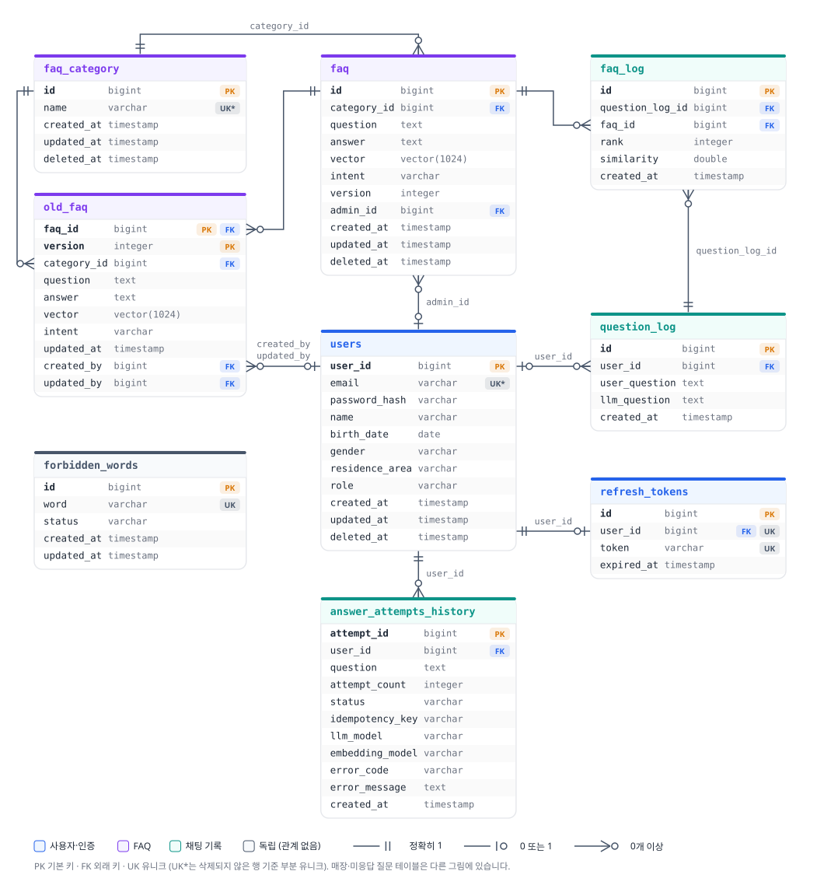
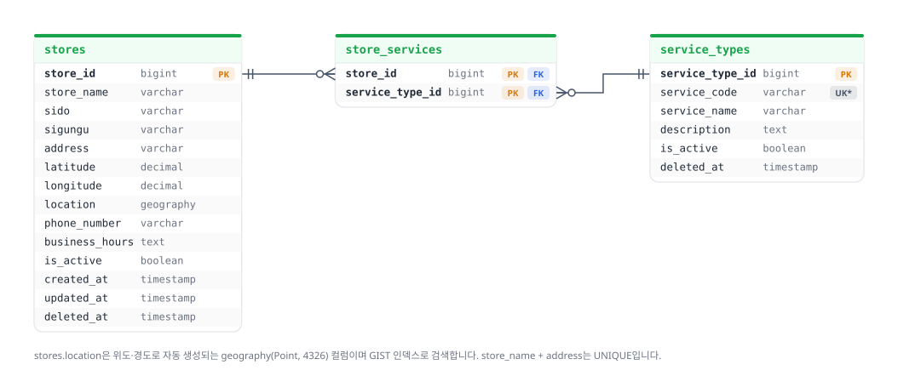
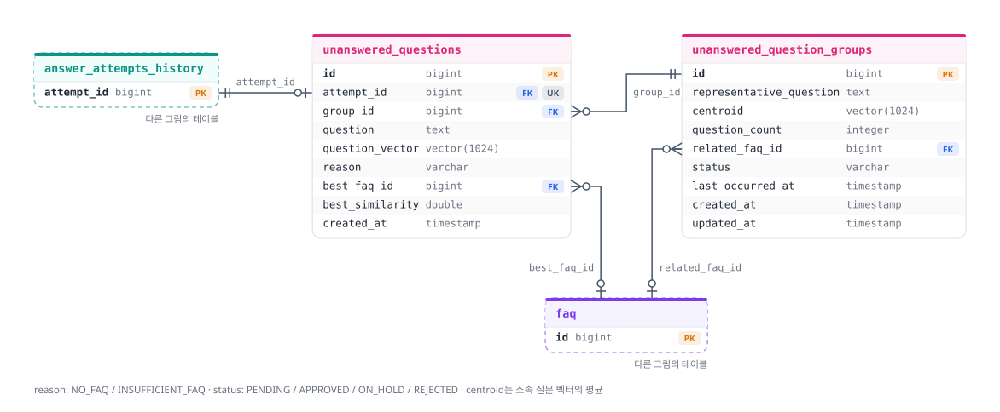

# DB 직접 조회하기

> 문서 기준: UBot-BE `develop` [`2fdb6ec`](https://github.com/ureca-UBot/UBot-BE/commit/2fdb6ec145d6092696651d83e4b6ff01ffb821c0) (2026-09-29 19:55 KST 커밋, #105 병합 시점) · 작성일 2026-09-30

로컬 PostgreSQL에 접속해 데이터나 pgvector·PostGIS 상태를 확인하는 방법입니다.
애플리케이션 실행에는 필요하지 않은 선택 단계입니다.

전제: [quickstart](../quickstart.md)의 3단계까지 완료되어 Compose의 `postgres` 서비스가 실행 중이어야 합니다. 아래 명령은 프로젝트 루트에서 실행합니다. 테스트용 Testcontainers DB와는 별개입니다.

## psql로 접속하기

별도 설치 없이 컨테이너 안의 psql을 사용합니다.

```powershell
docker compose exec postgres psql -U ubot -d ubot
```

이 개발 이미지의 기본 로컬 소켓 인증에서는 비밀번호를 묻지 않습니다. 인증 설정을 별도로 바꿨다면 해당 설정을 따릅니다. `.env`에서 `POSTGRES_USER`나 `POSTGRES_DB`를 바꿨다면 `-U`, `-d` 값도 맞춰 바꾸세요.

종료: `\q`

## DBeaver로 접속하기

새 PostgreSQL Connection을 만들고 아래 값을 입력합니다.

| 항목 | 값 |
|---|---|
| Host | `localhost` |
| Port | `.env`의 `POSTGRES_PORT` (`.env.example`은 `15432`) |
| Database | `.env`의 `POSTGRES_DB` |
| Username | `.env`의 `POSTGRES_USER` |
| Password | `.env`의 `POSTGRES_PASSWORD` |

`Test Connection`이 성공하면 완료입니다.

## pgvector와 PostGIS 활성화 확인

psql 또는 DBeaver에서 실행합니다.

```sql
SELECT extname, extversion
FROM pg_extension
WHERE extname IN ('vector', 'postgis')
ORDER BY extname;
```

`postgis` 3.6.4와 `vector` 0.8.6 두 행이 조회되면 정상입니다. 조회되지 않으면 [troubleshooting](../troubleshooting.md#vector-또는-postgis-extension이-없음)을 참고하세요.

## 주요 테이블

| 테이블 | 내용 |
|---|---|
| `users` | 회원. `role`은 `USER` 또는 `ADMIN`, `deleted_at`이 있으면 탈퇴 |
| `refresh_tokens` | 사용자당 refresh token 1개 |
| `faq_category`, `faq` | FAQ와 카테고리. `faq.intent`에 처리 의도. 벡터는 `faq_embeddings`에 있음 |
| `embedding_profiles`, `faq_embeddings` | 임베딩 서버별 Profile과, Profile별 FAQ 질문 임베딩(1024차원) |
| `old_faq` | FAQ 수정 전 버전 (`faq_id`, `version`) |
| `answer_attempts_history` | 채팅 답변 시도 1회당 1행. `status`(`PENDING`/`SUCCESS`/`FAIL`), `error_code`, `idempotency_key` |
| `question_log` | 성공한 질문과 생성 답변(`llm_question` 컬럼) |
| `faq_log` | 성공한 답변에 사용한 FAQ와 순위·유사도 |
| `unanswered_questions`, `unanswered_question_groups` | 답을 찾지 못한 질문(`NO_FAQ`/`INSUFFICIENT_FAQ`)과 비슷한 질문 묶음. 묶음 처리 상태는 `PENDING`/`APPROVED`/`ON_HOLD`/`REJECTED` |
| `unanswered_question_embeddings`, `unanswered_group_embeddings` | Profile별 미응답 질문 벡터와 묶음 중심 벡터. 묶음과 소속은 Profile과 무관하게 하나이고 벡터만 Profile별 |
| `forbidden_words` | 금지어 (`ACTIVE`/`INACTIVE`) |
| `stores`, `service_types`, `store_services` | 매장과 제공 서비스 |

### ERD

`V1`~`V15` 적용 후의 스키마입니다. 관계선은 실제 FK 제약만 그렸고, 매장과 미응답 질문 테이블은 따로 나눠 그렸습니다. `flyway_schema_history`는 생략했습니다.







- `answer_attempts_history`와 `question_log`·`faq_log` 사이에는 FK가 없습니다. 성공한 시도와 그 로그는 같은 트랜잭션에서 저장되지만 서로를 가리키는 컬럼은 없습니다.
- `forbidden_words`는 다른 테이블과 관계가 없습니다.
- 미응답 질문 테이블은 `answer_attempts_history`(시도당 최대 1건)와 `faq`(가장 가까웠던 FAQ)를 참조합니다. 저장 방식은 [architecture.md](../architecture.md#미응답-질문-저장-105)를 참고하세요.

예를 들어 최근 채팅 실패 사유는 아래처럼 확인합니다.

```sql
SELECT attempt_id, user_id, question, attempt_count, status, error_code, created_at
FROM answer_attempts_history
ORDER BY attempt_id DESC
LIMIT 20;
```

미응답 질문이 많이 쌓인 묶음은 아래처럼 확인합니다.

```sql
SELECT id, representative_question, question_count, status, last_occurred_at
FROM unanswered_question_groups
ORDER BY question_count DESC, last_occurred_at DESC
LIMIT 20;
```

## 로컬에서 관리자 계정 만들기

`tools/reset-local-db.ps1`로 DB를 초기화했다면 기본 `ADMIN` 계정이 함께 만들어집니다([로컬 DB 초기화와 기본 데이터 시드](reset-local-db.md)). 아래는 직접 가입한 계정을 관리자로 바꾸는 방법입니다.

`/admin/**` API는 `ADMIN` 역할이 필요하지만, 회원가입 API는 항상 `USER`로 계정을 만들고 역할을 바꾸는 API도 없습니다. 로컬 개발 DB에서는 회원가입한 계정의 역할을 직접 바꿉니다.

```sql
UPDATE users SET role = 'ADMIN' WHERE email = '가입한-이메일@example.com' AND deleted_at IS NULL;
```

인증 필터가 요청마다 DB에서 역할을 다시 읽으므로 이미 발급받은 access token으로도 바로 관리자 API를 호출할 수 있습니다. 다만 UBot-FE는 토큰 안의 `role` 값으로 관리자 화면 접근을 판단하므로, 프론트에서 관리자 화면을 쓰려면 **다시 로그인**해야 합니다. 이 방법은 개발 DB에서만 사용하세요. 운영 환경의 관리자 계정 발급 방식은 아직 정해지지 않았습니다.

## 주의사항

- 테이블 구조를 DBeaver나 psql로 직접 변경하지 않습니다. 스키마 변경은 Flyway 마이그레이션으로 관리합니다. 규칙은 [CONTRIBUTING.md](../../CONTRIBUTING.md#db-마이그레이션-flyway)를 참고하세요.
- FAQ는 SQL로 직접 넣지 말고 관리자 API로 등록하세요([local-data.md](local-data.md#2-faq-등록)).
- `local` 프로필은 Spring AI 벡터 스토어를 쓰지 않습니다(`spring.ai.vectorstore.type: none`). 그래서 `vector_store` 테이블이 자동으로 생기지 않습니다. JPA `ddl-auto: none`과는 별개의 설정입니다.
- Testcontainers는 별도 컨테이너·DB·임의 호스트 포트를 사용합니다. 위의 개발 DB 접속 정보로 테스트 DB를 조회하거나 정리하지 않습니다.
